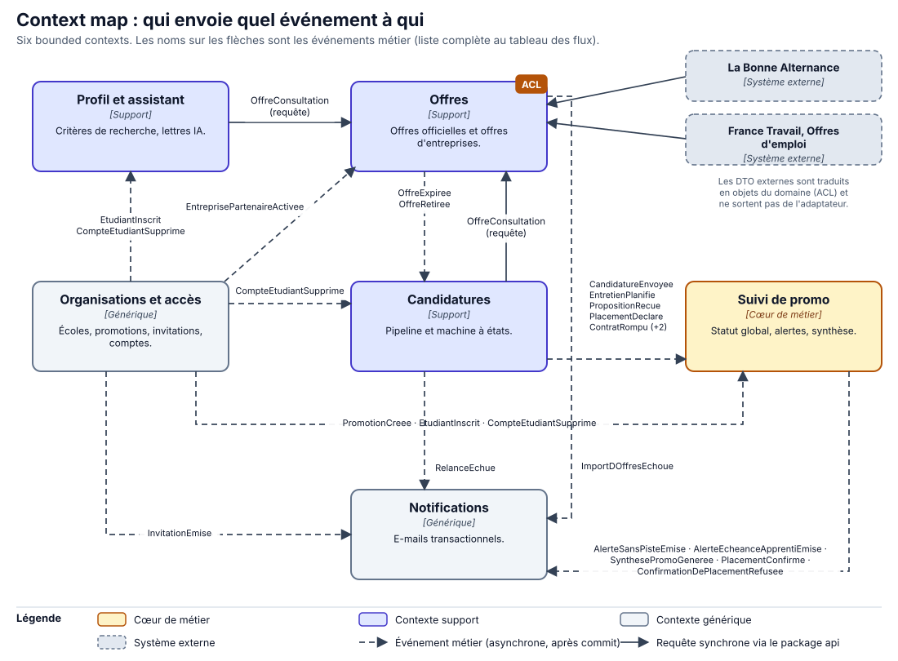
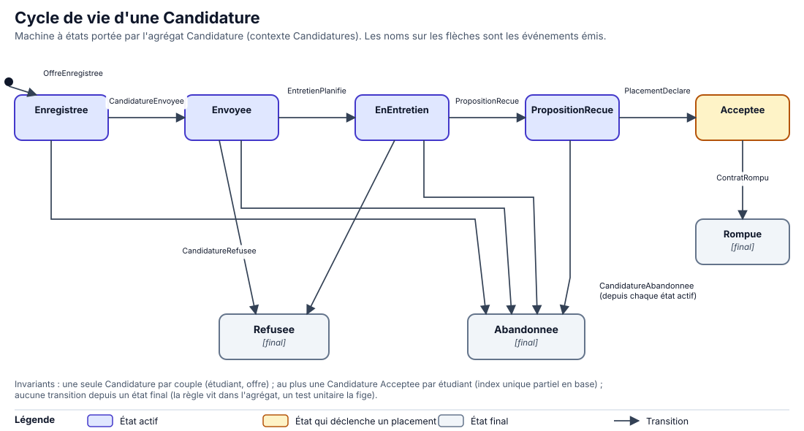

# Domaine

*Événements, bounded contexts, glossaire, context map*

Le domaine est décrit **avant** le code, et le code reprendra ces mots. Ce chapitre contient les 32 événements métier au passé, les six bounded contexts, le glossaire, la context map et la machine à états de la candidature.

## 1. Les événements métier

Trente-deux événements, tous au passé, regroupés par le contexte qui les émet. « Consommé par » donne le contexte qui réagit à l'événement. Les abréviations : **OA** Organisations et accès, **PA** Profil et assistant, **OF** Offres, **CA** Candidatures, **SP** Suivi de promo, **NO** Notifications.

| N° | Événement | Quand il se produit | Émis par | Consommé par |
|---|---|---|---|---|
| E01 | `EcoleCreee` | L'équipe crée une école (inscription assistée au démarrage) | OA | aucun |
| E02 | `PromotionCreee` | Un administrateur d'école crée une promotion | OA | SP |
| E03 | `InvitationEmise` | Un administrateur invite un étudiant, un référent ou une entreprise | OA | NO |
| E04 | `EtudiantInscrit` | L'étudiant accepte l'invitation et crée son compte | OA | PA, SP |
| E05 | `EntreprisePartenaireActivee` | Une entreprise invitée accepte et active son compte | OA | OF |
| E06 | `CompteEtudiantSupprime` | L'étudiant exerce son droit à l'effacement | OA | PA, CA, SP |
| E07 | `CriteresDeRechercheRenseignes` | L'étudiant précise domaine, zone, rythme, rentrée visée | PA | aucun |
| E08 | `LettreDeMotivationGeneree` | L'assistant produit un brouillon de lettre | PA | aucun |
| E09 | `QuotaDeLettresAtteint` | L'étudiant atteint son quota mensuel de lettres | PA | aucun |
| E10 | `OffresImportees` | Le planificateur importe un lot d'offres officielles | OF | aucun |
| E11 | `ImportDOffresEchoue` | Une source est indisponible après les relances | OF | NO |
| E12 | `OffrePubliee` | Une entreprise partenaire publie une offre | OF | aucun |
| E13 | `OffreReserveeALaPromotion` | L'entreprise réserve son offre à une promo | OF | aucun |
| E14 | `OffreExpiree` | La date limite est dépassée ou la source retire l'offre | OF | CA |
| E15 | `OffreRetiree` | L'entreprise retire son offre | OF | CA |
| E16 | `OffreEnregistree` | L'étudiant ajoute une offre à son pipeline | CA | aucun |
| E17 | `CandidatureEnvoyee` | L'étudiant déclare avoir postulé | CA | SP |
| E18 | `RelanceEchue` | La date de relance prévue est dépassée | CA | NO |
| E19 | `EntretienPlanifie` | L'étudiant enregistre un entretien | CA | SP |
| E20 | `PropositionRecue` | L'étudiant reçoit une proposition de contrat ou de stage | CA | SP |
| E21 | `CandidatureRefusee` | L'entreprise refuse ou ne répond pas | CA | SP |
| E22 | `CandidatureAbandonnee` | L'étudiant renonce à la piste | CA | SP |
| E23 | `PlacementDeclare` | L'étudiant déclare avoir signé | CA | SP |
| E24 | `ContratRompu` | L'étudiant déclare la rupture ou l'annulation | CA | SP |
| E25 | `StatutGlobalChange` | Le statut affiché à l'école est recalculé et diffère | SP | aucun |
| E26 | `PlacementConfirme` | Le référent confirme le placement déclaré | SP | NO |
| E27 | `ConfirmationDePlacementRefusee` | Le référent conteste le placement déclaré | SP | NO |
| E28 | `AlerteSansPisteEmise` | Aucune piste active depuis N jours | SP | NO |
| E29 | `AlerteEcheanceApprentiEmise` | L'échéance de 3 ou 6 mois sans employeur approche | SP | NO |
| E30 | `SynthesePromoGeneree` | La synthèse hebdomadaire d'une promo est prête | SP | NO |
| E31 | `NotificationEnvoyee` | Un e-mail est accepté par le service d'envoi | NO | aucun |
| E32 | `NotificationEchouee` | L'envoi échoue après relances | NO | aucun |

> [!IMPORTANT]
> **Pourquoi des événements sans consommateur ?**
>
> Les événements sans consommateur en V1 (E01, E07 à E10, E12, E13, E16, E25, E31, E32) sont tout de même émis : ils documentent le métier, alimentent le journal d'audit et serviront aux futurs consommateurs sans toucher au code émetteur. Ils sont publiés en mémoire, après commit ([ADR-003](adr/0003-patterns.md)).

## 2. Les six bounded contexts

| Contexte | Type | Responsabilité | Agrégats principaux | Schéma PostgreSQL |
|---|---|---|---|---|
| **Organisations et accès** | `Générique` | Écoles, promotions, invitations, comptes, rôles ; isole les données par école | `Ecole`, `Promotion`, `Compte`, `Invitation` | `organisations` |
| **Profil et assistant** | `Support` | Critères de recherche ; rédaction assistée des lettres ; quota | `ProfilEtudiant`, `LettreDeMotivation` | `profil` |
| **Offres** | `Support` | Importe les offres officielles (anti-corruption), publie celles des entreprises, réserve à une promo | `Offre` | `offres` |
| **Candidatures** | `Support` | Pipeline de l'étudiant, machine à états, déclaration de placement | `Candidature` | `candidatures` |
| **Suivi de promo** | `Cœur de métier` | Statut global par étudiant, alertes, synthèse de promo, confirmation des placements | `SuiviEtudiant`, `Alerte`, `SynthesePromo` | `suivi` |
| **Notifications** | `Générique` | Envoie les e-mails transactionnels à partir des événements | `Notification` | `notifications` |

**Pourquoi le suivi de promo est le cœur.** C'est là que se joue la différence du produit (statut global sans détail, alertes sur règles métier). C'est donc là que l'effort de modélisation et de test se concentre. Les contextes de support pourraient être remplacés par des services du marché ; les contextes génériques le seront probablement un jour.

**Pourquoi six et pas trois.** Un même mot n'a pas le même sens d'un contexte à l'autre, signe qu'il faut les séparer :

| Mot | Organisations et accès | Profil et assistant | Offres | Candidatures | Suivi de promo |
|---|---|---|---|---|---|
| **Étudiant** | Un compte rattaché à une promo | Un profil de recherche | (absent) | Le propriétaire d'un pipeline | Une ligne de la promo avec un statut |
| **Offre** | (absent) | Un texte à partir duquel rédiger | Une annonce officielle ou d'entreprise, avec sa source | Un instantané (titre, entreprise, lien) | (absent) |
| **Statut** | Actif, invité, supprimé | (absent) | Active, expirée, retirée | Enregistrée, envoyée, en entretien… | En recherche, en entretien, placé |

**Pourquoi six et pas huit.** Les conventions, la facturation et les flux de partenaires sont hors V1 : ils deviendront des contextes le jour où ils existeront, pas avant.

## 3. Le glossaire

Dix-huit termes du langage du métier. La colonne « Dans le code » donne le nom exact de la classe ou du package : **le code et les diagrammes utilisent ces mots, sans synonymes**. Les termes métier sont en français sans accents, les termes techniques en anglais (charte, [chapitre 06](06-charte.md)).

| Terme | Définition | Dans le code | Contexte |
|---|---|---|---|
| **École** | Établissement privé post-bac client de la plateforme. C'est le **tenant** : toutes les données sont isolées par école. | `Ecole`, `EcoleId` | OA |
| **Promotion** | Groupe d'étudiants d'une école pour une rentrée donnée et un type de parcours (alternance ou stage). | `Promotion` | OA |
| **Étudiant** | Personne inscrite dans une promotion, qui cherche une alternance ou un stage. | `Etudiant`, `EtudiantId` | OA |
| **Référent** | Membre de l'école chargé du placement (rôle `REFERENT`). Il voit le statut global de sa promo. | `Referent` | OA |
| **Entreprise partenaire** | Entreprise invitée par une école, qui peut publier des offres réservées. | `EntreprisePartenaire` | OA, OF |
| **Invitation** | Lien à usage unique et à durée limitée qui crée un compte rattaché à une école. | `Invitation` | OA |
| **Offre** | Annonce d'alternance ou de stage, officielle ou publiée par une entreprise partenaire. | `Offre`, `OffreId` | OF |
| **Source d'offre** | Origine d'une offre : La Bonne Alternance, France Travail, ou entreprise partenaire. | `SourceOffre` | OF |
| **Réservation** | Restriction d'une offre à une ou plusieurs promotions. | `Reservation` | OF |
| **Candidature** | Suivi par un étudiant d'une piste (offre) : de l'enregistrement jusqu'au placement ou à l'abandon. | `Candidature`, `CandidatureId` | CA |
| **Pipeline** | L'ensemble des candidatures d'un étudiant, par état. Privé à l'étudiant. | `Pipeline` | CA |
| **Placement** | Contrat ou stage signé : **déclaré** par l'étudiant, puis **confirmé** par le référent. | `Placement`, `PlacementDeclare` | CA, SP |
| **Statut global** | Synthèse affichée à l'école : *en recherche*, *en entretien* ou *placé* (avec la mention *à confirmer*). | `StatutGlobal` | SP |
| **Suivi** | Ligne d'une promo : un étudiant, son statut global, la date du dernier changement. | `SuiviEtudiant` | SP |
| **Alerte** | Signal levé par une règle métier : étudiant sans piste, échéance d'apprenti sans employeur. | `Alerte`, `TypeAlerte` | SP |
| **Synthèse de promo** | Chiffres agrégés d'une promo (répartition par statut, évolution) et résumé rédigé. | `SynthesePromo` | SP |
| **Lettre de motivation** | Texte rédigé avec l'assistant à partir du profil et de l'offre. Appartient à l'étudiant. | `LettreDeMotivation` | PA |
| **Apprenti sans employeur** | Étudiant en CFA sans contrat, soumis aux délais de 3 mois (entrée) ou 6 mois (rupture). | `FenetreSansEmployeur` | SP |

## 4. Le statut global

Le statut global est **calculé**, jamais saisi par l'école. Il se déduit des événements du pipeline, dans cet ordre de priorité :

| Si… | Alors le statut global est… | Visible par l'école |
|---|---|---|
| Un placement a été confirmé par le référent et le contrat n'est pas rompu | **Placé** | oui |
| L'étudiant a déclaré un placement, le référent n'a pas encore confirmé | **Placé** (à confirmer) | oui |
| Au moins une candidature est en entretien ou en proposition reçue | **En entretien** | oui |
| Sinon | **En recherche** | oui |

| L'école voit | L'école ne voit jamais |
|---|---|
| Le statut global de chaque étudiant de sa promo | Les offres enregistrées ou postulées |
| La date du dernier changement de statut | Les entreprises ciblées, les refus, les notes |
| Les alertes levées (sans piste, échéance) | Les lettres de motivation et le profil de recherche |
| La synthèse agrégée de la promo | Le nombre de candidatures de l'étudiant |

> [!NOTE]
> **Hypothèse à valider avec les étudiants**
>
> **Qui confirme un placement.** J'ai posé que l'étudiant déclare et que le référent confirme, pour éviter qu'un statut « placé » inexact fausse les chiffres de l'école. Ce flux est une proposition de ma part : il n'a été validé ni par une école ni par un étudiant. De même, l'alerte « sans piste » révèle indirectement une inactivité : il faut vérifier en entretien que les étudiants l'acceptent.

## 5. La context map : lecture

Les flèches pointillées sont des **événements** (asynchrones, après commit). Les flèches pleines sont des **requêtes** synchrones, uniquement via le package `api` du module fournisseur (`OffreConsultation`). Chaque événement du schéma figure au tableau du §1 : c'est la même source.

- **Organisations et accès** est en amont de presque tout : sans école ni promo, rien n'existe. Il émet 6 événements et n'en consomme aucun.
- **Candidatures** alimente **Suivi de promo** : le suivi ne lit jamais les candidatures, il reçoit 7 événements de pipeline (E17 à E24 sauf E18) et en déduit le statut global. C'est ce qui garantit que l'école ne peut pas accéder au détail.
- **Offres** protège le reste du système derrière une **couche anti-corruption** : les DTO de La Bonne Alternance et de France Travail sont traduits en objets `Offre` à l'intérieur de l'adaptateur et n'en sortent pas.
- **Notifications** est un puits : elle reçoit de quatre contextes et n'émet que ses propres événements.
- **Suppression RGPD** : `CompteEtudiantSupprime` est le seul événement qui touche trois consommateurs (PA, CA, SP). Chacun efface ses propres données.

## 6. La machine à états de la candidature

L'agrégat `Candidature` porte la règle : les transitions autorisées sont celles du schéma, aucune autre. Les transitions interdites (par exemple repasser de `Refusee` à `Envoyee`) lèvent une exception de domaine `TransitionInterdite` qui devient une réponse HTTP 422 ([chapitre 06](06-charte.md)). Deux invariants :

1. Une seule candidature par couple (étudiant, offre).
2. Au plus une candidature `Acceptee` par étudiant, garantie en base par un index unique partiel (`CREATE UNIQUE INDEX … ON candidatures.candidature (etudiant_id) WHERE statut = 'ACCEPTEE'`).

La **règle d'échéance** (alerte `AlerteEcheanceApprentiEmise`) vit dans Suivi de promo : pour un étudiant d'une promo en alternance sans placement, l'alerte se lève à 30 jours de la fin de la fenêtre de 3 mois après la rentrée, ou de 6 mois après un `ContratRompu`. Le nombre de jours d'avance est un paramètre de l'école `Hypothèse`.
