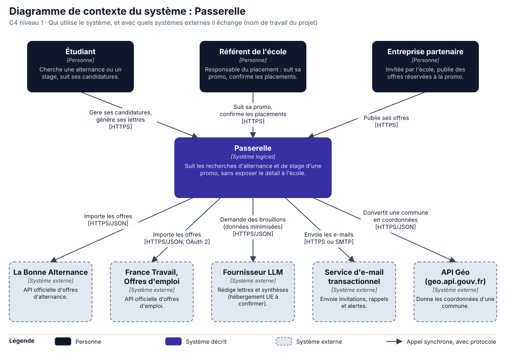
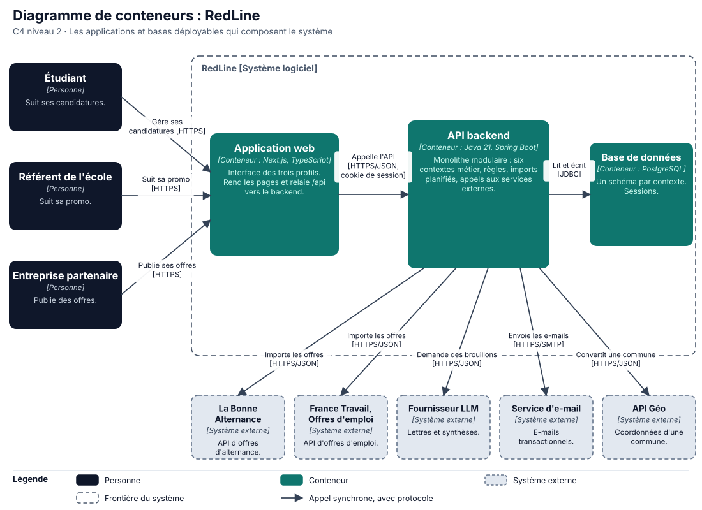
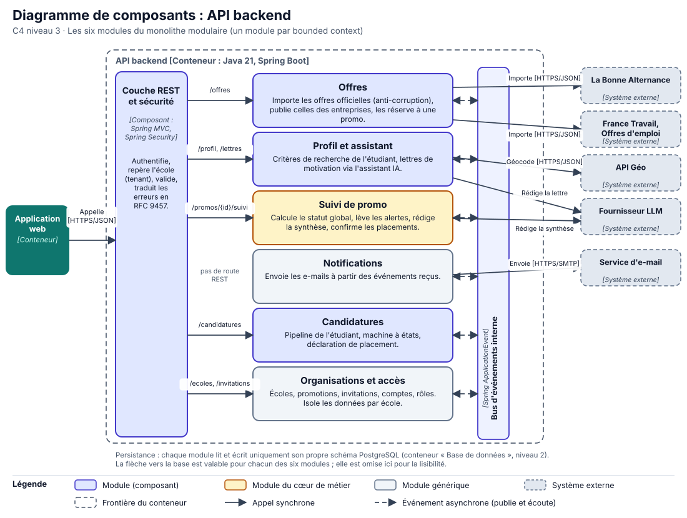

# Diagrammes C4

*Contexte, conteneurs, composants*

Trois niveaux du modèle C4, du plus large au plus fin : le **contexte** (qui utilise le système, avec quels systèmes externes), les **conteneurs** (ce qui se déploie), les **composants** du conteneur le plus important (l'API backend, où vit toute la logique).

## Notation appliquée

Chaque diagramme a un **titre**, son **niveau C4**, une **légende** et des **flèches libellées** (verbe d'action et technologie entre crochets). Les systèmes externes sont **en pointillé et en gris**. Le même code visuel sert aux trois niveaux. Les sources SVG sont dans `docs/c4/`.

| Élément | Forme |
|---|---|
| Personne | Rectangle sombre |
| Système décrit | Rectangle indigo |
| Conteneur | Rectangle vert |
| Composant (module) | Rectangle clair, bordure indigo ; doré pour le cœur de métier, gris pour le générique |
| Système externe | Rectangle gris en pointillé |
| Appel synchrone | Flèche pleine avec protocole |
| Événement asynchrone | Flèche en pointillé |

## Cohérence entre les trois niveaux

Un élément du niveau supérieur se retrouve **à l'identique** au niveau inférieur : mêmes noms, mêmes systèmes externes, mêmes flèches.

| Niveau 1 : contexte | Niveau 2 : conteneurs | Niveau 3 : composants |
|---|---|---|
| Étudiant, Référent de l'école, Entreprise partenaire | Les mêmes trois personnes | (hors du conteneur, représentées par l'Application web) |
| **Passerelle** (système) | Application web, API backend, Base de données | — |
| La Bonne Alternance, France Travail, LLM, e-mail, API Géo | Les mêmes cinq systèmes externes | Les mêmes cinq, reliés aux modules qui les appellent |
| Flèche « Importe les offres » | API backend → La Bonne Alternance et France Travail | Module **Offres** → La Bonne Alternance et France Travail |
| Flèche « Demande des brouillons » | API backend → Fournisseur LLM | Modules **Profil et assistant** et **Suivi de promo** → Fournisseur LLM |
| Flèche « Envoie les e-mails » | API backend → Service d'e-mail | Module **Notifications** → Service d'e-mail |
| Flèche « Convertit une commune » | API backend → API Géo | Module **Profil et assistant** → API Géo |
| — | API backend → Base de données | Chaque module → son schéma de la base (flèche omise, voir note du diagramme) |

Les six modules du niveau 3 sont les **six bounded contexts** de la context map du [chapitre 02](../02-domaine.md), avec les mêmes noms.

